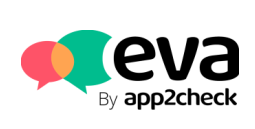

# Integrazione della piattaforma EVA per AI-based chatbots con il Microsoft Bot Framework e Web Chat

Questo progetto è sviluppato per il corso di ***Software Engineering*** dell'***Università di Genova*** in collaborazione con l'azienda ***App2Check srl*** durante l'a.a. 2019/2020.

	
	&emsp;&emsp;&emsp;
	

## Introduzione
Un ***chatbot*** è un assistente virtuale in grado di recuperare istantaneamente la soluzione corretta ai problemi o le giuste informazioni su un certo prodotto/servizio. 
In questo progetto si vuole implementare un chatbot con funzionalità equivalenti a quelli realizzabili tramite la piattaforma ***EVA*** già implementata da ***app2check***.

	

## Obiettivo
L'obiettivo del progetto, è quello di progettare e implementare un modulo di integrazione software utilizzando il componente open source ***"Microsoft Bot Framework SDK"***, che consente di gestire la logica dei bot nel back-end, e la piattaforma EVA. 
Successivamente si dovrà integrare la componente open source ***"Microsoft Bot Framework Web Chat"*** che permette di visualizzare e gestire l'interfaccia utente del bot nel front-end.

## User Manual
### Istruzioni d'uso
1. Scaricare la cartella ***WebChat*** contenuta nella cartella *src*;
2. Fare doppio click sul file "***homePage.html***" per avviare l'homepage, contenente il bot, sul browser;

All'avvio della pagina, sarà presente l'immagine del bot in basso a destra.

3. Fare click sull'immagine per avviare il bot.
4. In seguito all'avvio del bot, verranno mandati dei messaggi di benvenuto per l'utente.
5. Adesso, è possibile interrogare il bot.

### Customizzazione del bot
Attraverso la *barra degli indirizzi* (***URL***) è possibile **personalizzare** a proprio piacimento la chat.

Cambiando il valore di questi parametri è possibile personalizzare la grafica:
- ***userBaloonColor***: colore delle vignette dell’utente.
- ***botBaloonColor***: colore delle vignette del bot.
- ***title***: indirizzo del logo del chatbot.
- ***sendBtnColor***: colore del bottone per l’invio del messaggio.
- ***serverUserImage***: immagine usata come avatar se il parametro “video” è settato a “false”.
- ***botTextColor***: colore del testo nelle vignette del bot.
- ***botBtnColor***: colore delle suggested action.
- ***botBtnTextColor***: colore del testo delle suggested action.
- ***userTextColor***: colore del testo nelle vignette dell’utente.
- ***sendTextColor***: colore del testo nella barra di scrittura del messaggio.
- ***sendBackgrColor***: colore del background della barra di scrittura del messaggio.

Sono presenti ulteriori parametri che permettono di modificare delle caratteristiche funzionali del bot.

- ***video***: valore booleano.
	- Se è *true*, utilizza come avatar la gif di EVA animata.
	- Se è *false*, utilizza come avatar l’immagine passata nel campo dell’URL serverUserImage.
Se non viene settato, il suo valore di default è “true” perciò il bot utilizza la gif.

- ***speech***: valore booleano.
	- Se è *true*, verrà visualizzata la gif di EVA che parla, inoltre è possibile inviare un messaggio vocale al bot e in quest'ultimo, come risposta, leggerà il testo del messaggio;
	- Se è *false*, invierà il messaggio normalmente senza leggerlo.
Se non viene settato, il suo valore di default è “false.

- ***botId***: id del bot che si interroga. (Vedi **N.B.** a fondo pagina)

- ***isDev***: valore booleano.
	- Se è *true*, il bot viene avviato in modalità sviluppo;
	- Se è *false*, il bot viene avviato in modalità produzione.
Se non viene settato, il valore di default p “false” perciò il bot parte di default in modalità produzione.

- ***supportEmail***: specifica l’email associata al bot. (Vedi **N.B.** a fondo pagina)

- ***url***: visualizza il chatbot come anteprima sul sito che viene passato come parametro.

**N.B.**  
I parametri ***botID*** e ***supportEmail*** sono associati all'account EVA sul quale è presente il bot che viene interrogato.  
Quindi, **NON** vanno modificati a piacimento perché altrimenti il bot non funzionerebbe.
